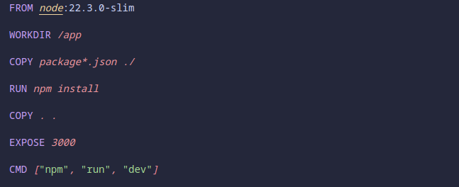

# Proyecto 0 - Desarrollo de Soluciones Cloud

Desarrollado por Valeria Caro Ramirez

## Tecnologias utilizadas

Para la realización del proyecto se utilizo el siguiente stack tecnológico:

* FastAPI & Swagger (Backend)
* SQLAlchemy
* JWT
* Uvicorn
* Docker
* React & Vite (Frontend)

## Despliegue en Docker

Para realizar el despliegue en docker, se configuro un docker compose que desplegara los servicios de frontend, backend y base de datos.


### Descripción de servicios de docker

* **Backend** : Servicio que ejecuta la lógica de la aplicación. Se construye desde el código fuente en la carpeta `backend` y expone el puerto  **8000** . Depende de la base de datos para funcionar. Para este servicio se configuro un dockerfile, con las siguientes configuraciones:
  
  Este **Dockerfile** configura un contenedor ligero para una aplicación en **Python 3.12** con **FastAPI** y  **Uvicorn**.
* **Database** : Servicio de base de datos PostgreSQL que almacena la información de la aplicación. Usa credenciales predefinidas y persiste los datos en un volumen.
* **Frontend** : Servicio que gestiona la interfaz de usuario. Se construye desde la carpeta `frontend`, mantiene sus dependencias en un volumen y expone el puerto **3000** para acceso desde el navegador. Para este servicio se configuro un dockerfile, con las siguientes configuraciones:
  
  Este **Dockerfile** configura un contenedor ligero para una aplicación  **Node.js 22.3.0** .

## Como ejecutar los servicios?

Para iniciar los contenedores, ejecuta el siguiente comando desde la carpeta raíz del proyecto, donde se encuentra el archivo `docker-compose.yml`

```sh
docker compose up -d
```

## Información sobre los servicios

* Para acceder al frontend, dirijase a la siguiente dirección: **localhost:3000**
* Para acceder al backend, dirijase a la siguiente dirección: **localhost:8000**

## Como detener los servicios?

Para deterner los contenedores, ejecuta el siguiente comando desde la carpeta raíz del proyecto, donde se encuentra el archivo `docker-compose.yml`

```sh
docker compose down -v
```
